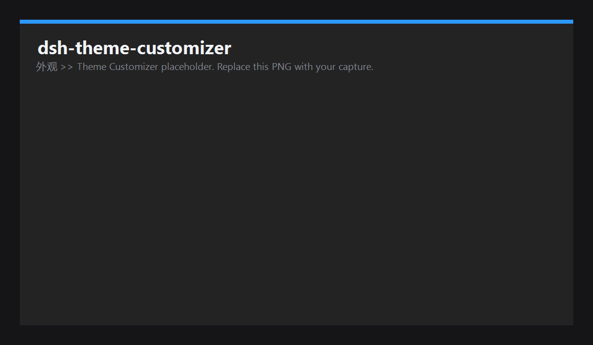

# dsh-theme-tuner

一个针对 DeepSeek Harness (DSH) 的 Web 客户端插件：在**「通用设置 → 外观」下方**直接追加一组
**强调色 / 背景 / 前景 / 对比度** 控件，让你**合并调整**界面配色，而不像参考截图那样把浅色和深色做成两块
独立的大面板，也不必单独占一个左侧标签页。

页面交互（如参考图的 Codex 风格）：**深浅切换直接复用上方「外观」里的 浅色 / 深色 / 跟随系统**，
「主题定制」会按当前主题调整。两套配色（浅色、深色）分别保存；<b>对比度</b>会以当前主题为基准微调前景文字的
“清晰度”（值越大越接近纯黑/纯白，值越小越接近背景，越柔和）。

## 功能

- 放在「通用设置 → 外观」正下方，合并调整 **强调色 / 背景 / 前景 / 对比度**。
- 深浅（以及跟随系统）切换**复用「外观」**，无需重复的切换按钮；按当前主题调整。
- 浅色、深色两套配色**分别保存**；对比度按当前主题微调前景清晰度。
- 改动**实时生效**（`theme.overrideTokens` 写入 `--dsw-alias-*`），可随时**恢复当前主题默认**。

## 安装（从本仓库）

```sh
# 用官方 CLI 从 GitHub 安装（web profile 需已初始化）
dsh plugin --profile web add github:shawnlone/dsh-theme-tuner
```

> 本仓库是「仓库根即插件包」：`package.json` 声明了 `dsh.bundle.patch`（安装入口）
> 与 `dsh.client`（浏览器端 UI），仓库根放有 `cordis.patch.yml`。
> **新增插件需重启一次对应的 web profile** 才会生效。

## 截图



> 上图是「通用设置 → 外观 → 主题定制」的界面截图（深色主题）。
> 该图同时用于插件市场（`data/screenshots.json`）的详情展示。

## 原理

- 通过 DSH 的 `theme` 服务调用 `overrideTokens(source, tokens)`，把自定义值写入 `--dsw-alias-*` 等 CSS 变量：
  - 强调色：`--dsw-alias-brand-primary`、`--dsw-alias-button-primary-fill`、`--dsw-alias-state-business-primary`
  - 背景：`--dsw-alias-bg-base`、`--dsw-alias-bg-layer-1/2/3`、`--dsw-specific-sidebar-fill`
  - 前景：`--dsw-alias-label-primary/secondary/tertiary`（由所选前景色 + 对比度自动推导）
- 通过 `settingsScope.bind({ namespace: "theme-tuner" })` 读取/写入 **主机设置文档**，实现持久化。
- 通过 `settings.general.item` 插槽注册一行（id `theme-tuner`，order 15），排在「外观」（order 10）正下方。

## 目录结构

```
dsh-theme-tuner/
  package.json          # 双面插件清单：dsh.client + dsh.bundle.patch
  cordis.patch.yml      # 作为 bundle 挂载时的插件行（insert）
  LICENSE               # MIT
  CHANGELOG.md
  README.md
  scripts/
    install.ps1         # 一键安装到 web profile（备份 + dsh plugin add + 提示重启）
    install.sh          # macOS/Linux 等同款安装脚本
  lib/
    index.js            # 主机半区：注册 theme-tuner 设置命名空间 + schema
    client.js           # 浏览器半区：设置行 UI + token 应用（可直接部署的 bundle）
    types/              # 类型声明（供 TS 消费方使用）
  preview.html          # 独立预览，本插件效果的可视化 Demo
```

## 一键安装（推荐）

```pwsh
pwsh -File .\scripts\install.ps1
```

脚本会：备份 `profile/package.json` → 先尝试官方 `dsh plugin --profile web add link:<本目录>`（内部用 pnpm 安装并把
`dsh-theme-tuner` 追加到 `dsh.profile.bundles`）。

> 若官方 pnpm 路径被 profile 的供应链策略（`minimumReleaseAge`）拦截（常见、且多为既有状态），
> 脚本会自动回退到**本地 junction 安装**（不走 pnpm / 网络）：在 `profile/node_modules` 下 junction 插件目录、
> 把 host 需要的 `@deepseek-ai/dsh-settings` 与 `@deepseek-ai/schemastery` junction 进插件自身 `node_modules`，
> 再把插件追加到 `dsh.profile.bundles`。

> ⚠️ 新增插件的 **生效需要重启 profile**。脚本成功后请重启桌面端 / web profile，
> 重启后即可在设置页看到「主题定制」。

### 本机当前状态
已在 `~/.dsh/profiles/web` 完成安装（junction + `dsh.profile.bundles`），并已用 profile 的 boot 组合
（`loadProfile` + `composeEntries`）验证：`theme-tuner -> dsh-theme-tuner` 行已进入组合后的条目列表、
host 依赖解析成功。**重启一次 DSH 即可在设置里看到「主题定制」。**

## 安装到运行中的 DSH

> 注意：**新增一个插件需要重启对应 profile**（`dsh-client-modules` 会缓存插件集元数据，
> “plugin-set changes take effect on restart”）。加入 bundle 列表后，请重启 DSH Web 应用。

方式一（官方 CLI，适合已发布/可解析的包）：

```sh
dsh plugin --profile web add dsh-theme-tuner
```

方式二（本地开发，link 到本目录）：

```sh
# 在 web profile 目录
cd "$DSH_HOME/profiles/web"
pnpm add link:D:/VSC_Projects/dsh-theme-tuner
```

然后把包名加入 `$DSH_HOME/profiles/web/package.json` 的 `dsh.profile.bundles`（追加到末尾），
或在 `$DSH_HOME/profiles/web/cordis.patch.yml` 中插入：

```yaml
- insert:
    - id: theme-tuner
      name: 'dsh-theme-tuner'
```

## 退出/禁用

在对应 profile 的 `cordis.patch.yml` 中给该行加 `disabled: true`，或从 `dsh.profile.bundles` 移除后重启。

## 说明 / 已知限制（初版）

- `对比度` 目前作用于**前景文字**（相对背景做明度拉伸），不作用全局滤镜；后续可扩展为
  逐层表面(层-1/2/3)与边框的同步调优。
- 主题的浅/深/跟随系统切换**复用 DSH 自带的「外观」行**（本插件不再自建切换）。
- `editor`：本包是按「仓库根即插件包」组织的：`lib/`（bundle 与 host 半区）、`scripts/`（安装脚本）、
  `preview.html`（独立效果预览）。
- 该插件默认会应用仿参考图的一套配色（蓝色强调色等）。若希望“不改就不生效”，可以在
  `lib/client.js` 的 `applyTokens` 中改为：仅当用户写入过任意值时才调用 `overrideTokens`。
