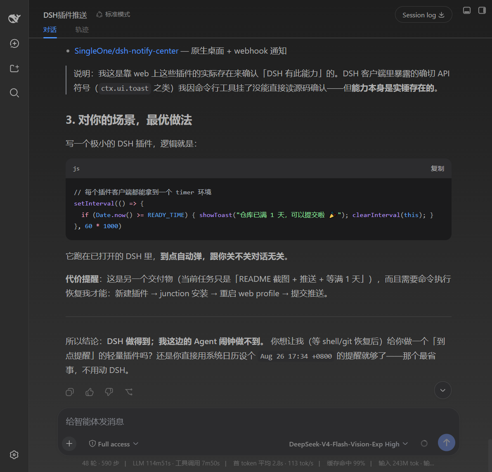
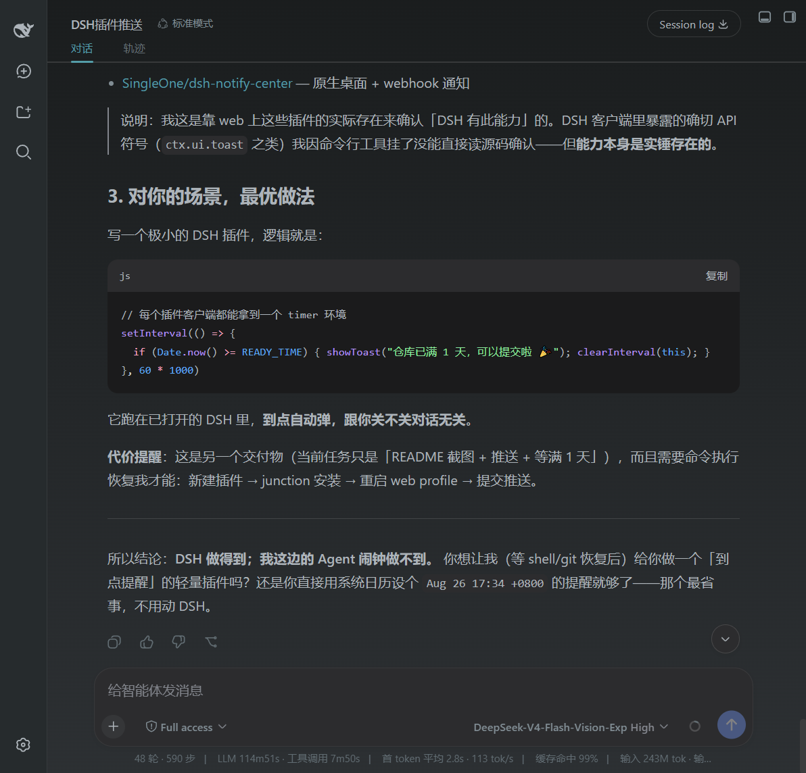
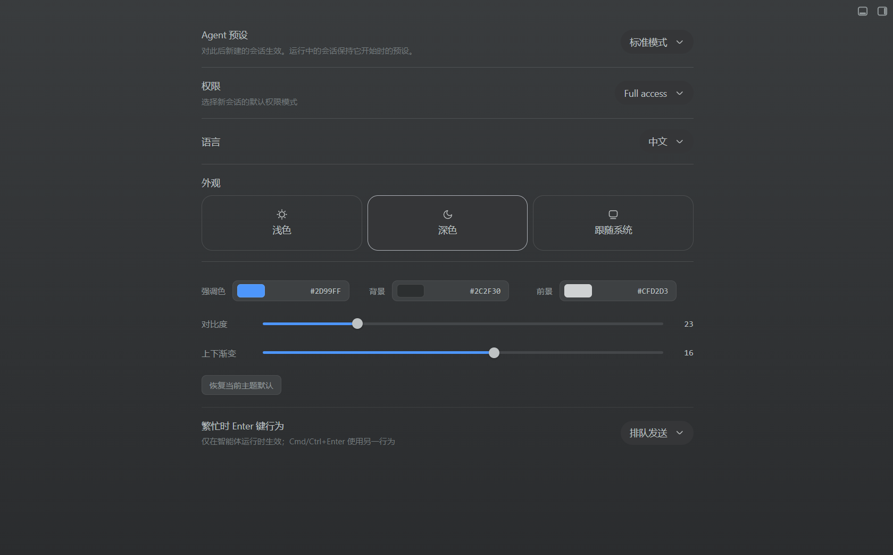
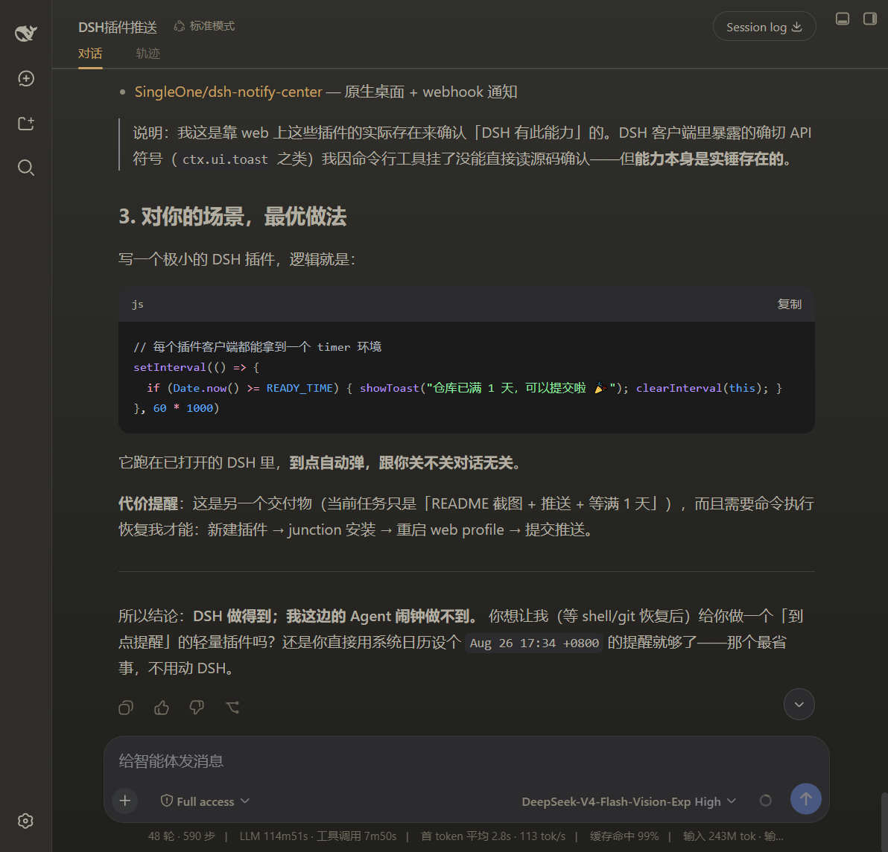
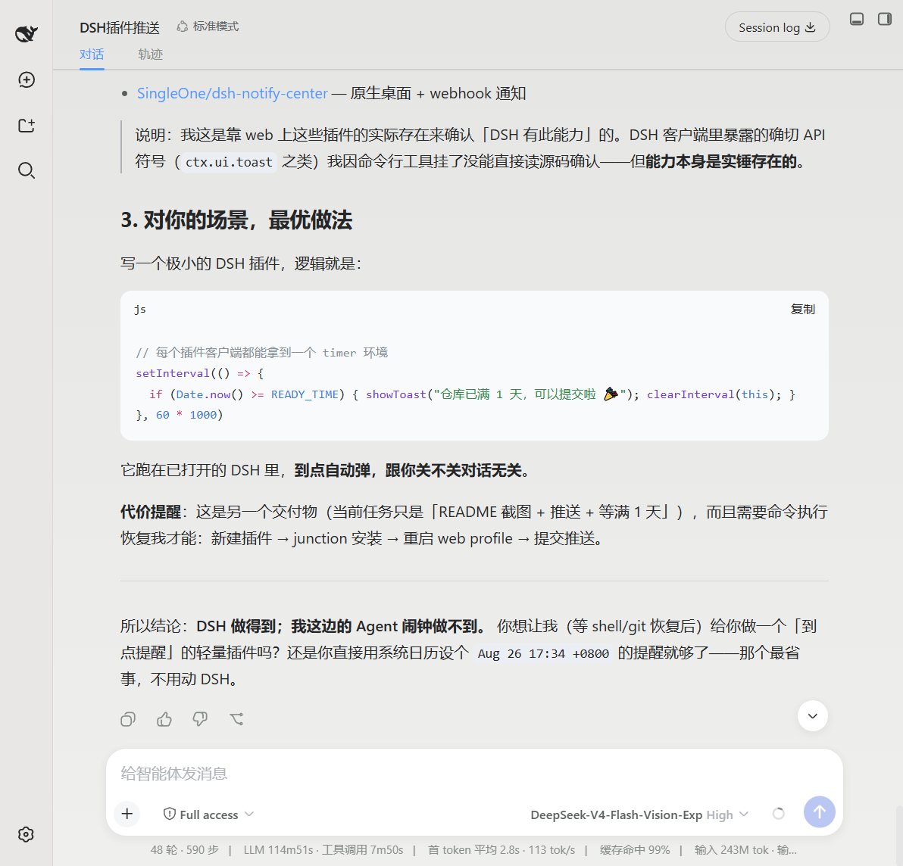
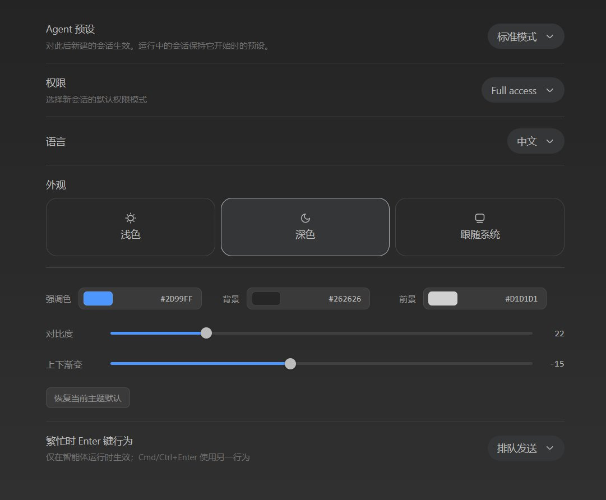

# dsh-theme-tuner

> [Chinese README](README.md)

Customize the DeepSeek Harness (DSH) interface theme directly under the built-in **Appearance** settings — accent, background, foreground, contrast and gradient, applied live.

> Reuses the built-in Appearance **light / dark / system** switch, so there is no duplicate theme toggle.

## Screenshots

| <br>Dark · theme effect | <br>Dark · theme effect | <br>Dark · theme effect |
| --- | --- | --- |
| <br>Dark · theme effect | <br>Light · theme effect | <br>Theme settings panel |

## Features

- Sits directly under **General Settings → Appearance**, adjusting **accent / background / foreground / contrast / gradient**.
- Reuses the built-in Appearance light / dark / system switch and tunes the **currently active** theme.
- Keeps the light and dark palettes **separately**; the contrast slider softens or sharpens the foreground text per theme.
- Applies **live** via DSH `theme.overrideTokens` (`--dsw-alias-*` design tokens), with a one-click **reset to the current theme default**.

## Install

```sh
dsh plugin --profile web add github:shawnlone/dsh-theme-tuner
```

> This repo is organised so the **repo root is the plugin package**: `package.json` declares `dsh.bundle.patch` (the install entry) and `dsh.client` (browser UI), with `cordis.patch.yml` at the root.
> A new plugin needs a **profile restart** to take effect. `scripts/install.ps1` / `scripts/install.sh` helpers (with a local-junction fallback when a pnpm supply-chain policy blocks the normal path) are also provided.

## How it works

The plugin writes your values into DSH's design tokens:

- **accent** → `--dsw-alias-brand-primary` / `--dsw-alias-button-primary-fill` / `--dsw-alias-state-business-primary`
- **background** → `--dsw-alias-bg-base` / `--dsw-alias-bg-layer-1/2/3` / `--dsw-specific-sidebar-fill`
- **foreground** → `--dsw-alias-label-primary/secondary/tertiary` (derived from the chosen foreground + contrast)

Settings persist through the `theme-tuner` settings namespace. The row registers into `settings.general.item` (order 15), directly under the built-in Appearance (order 10).

## Structure

```
dsh-theme-tuner/
  package.json          # dual-face manifest: dsh.client + dsh.bundle.patch
  cordis.patch.yml      # bundle mount row (insert)
  lib/index.js          # host half: registers the theme-tuner settings namespace + schema
  lib/client.js         # browser half: settings row + live token application
  scripts/              # install.ps1 / install.sh
  preview.html          # standalone demo
  assets/               # docs / plugin-market screenshots
```

## License

[MIT](LICENSE)
